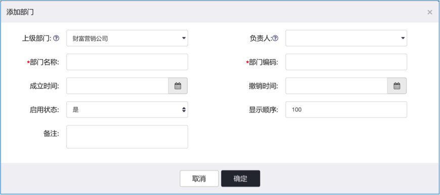
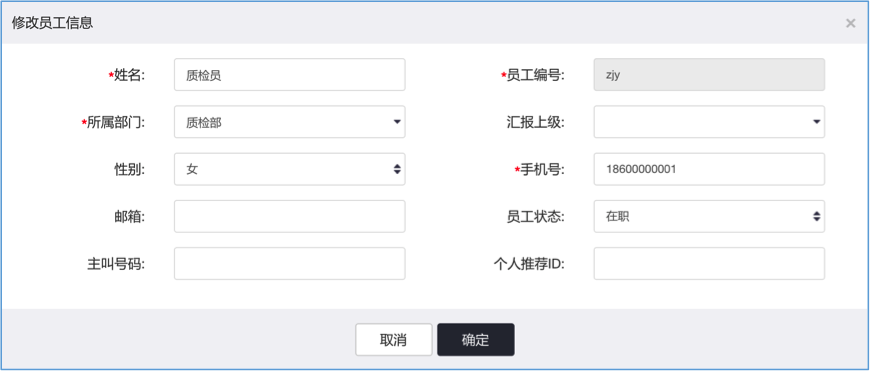
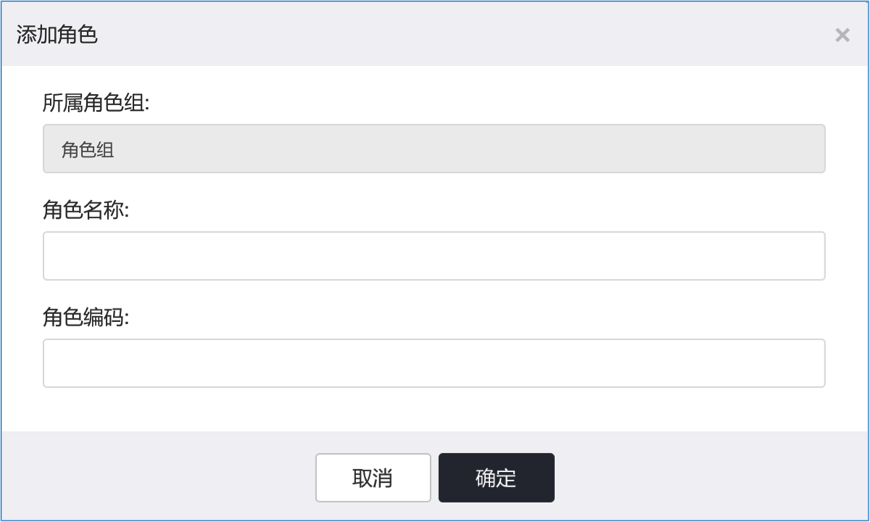
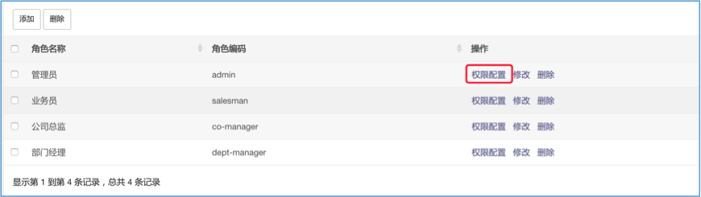
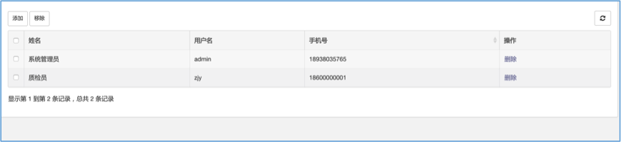
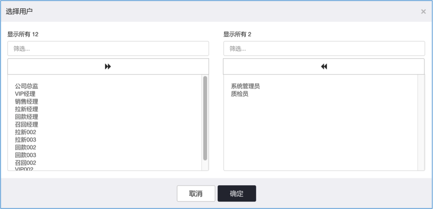
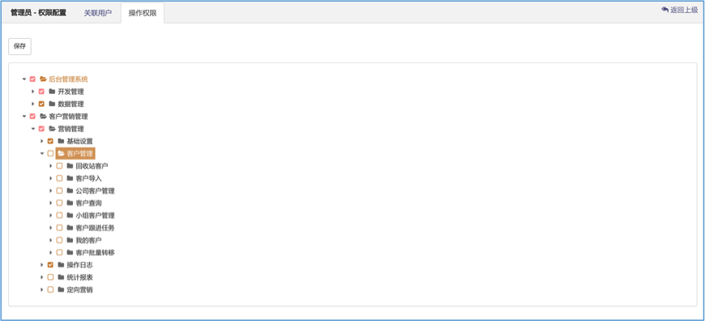

# 部门与员工管理

本系统中的组织架构，主要是业务需求的组织架构，并不完全等同于公司的的实际人事组织架构。

可根据公司实际业务需求，添加组织架构。

!> 部门与员工不等同于公司通讯录，也不具备公司通讯录的功能；该功能可以理解成`公司通讯录中的销售部门`，
其底下是以不同业务区分的业务小组。

## 配置部门与人员

初次使用需以系统内置的`admin`账号登录

- 点击`部门与员工`功能菜单，进入部门与员工组织结构管理

- 添加部门树

点击左侧模块顶部的`添加`按钮，添加部门，如下图所示：

!> `部门负责人`具有查看该部门以及下级部门的客户以及相关业务员的任务。

## 添加人员

点击页面右侧的`公司人员`模块顶部的`添加`按钮，添加公司人员，如下图所示：

!> 员工编号就是用户登录系统的账号，初始密码为：**123456**；
员工编号具有唯一性，不可重复，填写的时候请注意；
如果需要对接`呼叫中心`则主叫号码不能为空(具体格式以呼叫中心要求为准)。

## 用户权限管理

用户权限管理，用来管理系统用户的功能权限（即什么样的用户角色配置什么样的功能权限），可设置不同的角色，配以角色权限控制，达到控制用户功能权限管理的效果。

admin账号登录，点击`开发管理`功能模块下的`角色管理`菜单，打开角色管理界面。

!> 用户权限管理不等同于公司组织架构管理，用户权限是平行结构，用以控制用户功能，即什么角色的用户具有哪些功能；
组织架构是多级树形结构，是以实际业务需求为基础的业务分群。

> 角色管理

单击`添加`按钮，添加用户角色。如下图所示：

!> 角色编码具有唯一性，不可重复

> 权限配置

主要配置哪些用户具有什么角色并且能使用系统哪些功能。

如下图所示，点击角色列表中某具体角色后面的`权限配置`按钮，进入权限配置界面：

> 关联用户

点击页面左上角的`添加`按钮为某角色关联用户。如下图所示：

> 配置功能权限

进入操作权限界面，如下图所示，勾选需要开放给当前角色的功能并点击`保存`按钮即可：

具体权限配置请参考用户功能权限配置对照表。// TODO:添加超链接

