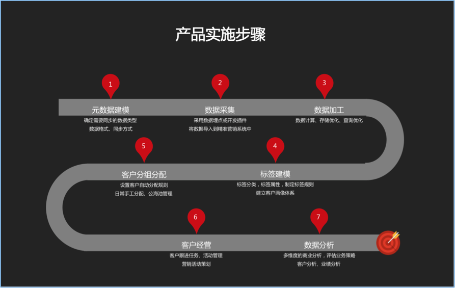
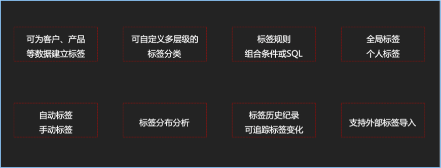
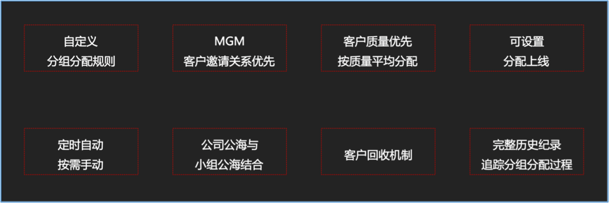
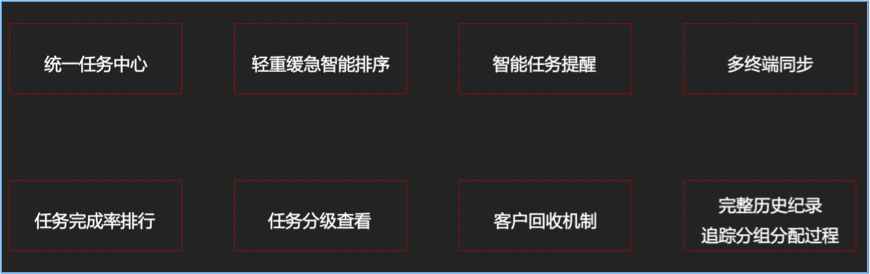

# 概述

《智能营销系统》利用大数据技术，对企业的经营数据（客户数据、交易记录、操作轨迹、客户维系）进行建模、采集、加工。
根据规则对客户进行多维度标签化，逐步刻画出完整的客户画像，从而定位目标客户群体，实现以客户为中心的精准营销，
为企业带来更高的投资回报率。

## 应用场景

> 智能化客户分组分配管理

根据客户特征进行分群，将不同群体客户分配给不同客户经营团队，并实现任务的智能排序。
如将客户分为新注册客户、成交客户、VIP客户、流失客户分别分配给不同销售团队。

> 寻找产品目标客户，投其所好，提高销售成功率

针对已有产品特性，寻找目标用户群体；分析用户行为，为其推荐可能感兴趣的产品
提高产品销售成功率，降低销售成本。

> 根据市场反馈，优化产品结构及特性

对客户交易数据、商品浏览日志等不同类型数据分析，了解市场形态，有针对性的优化产品结构及特性，使得产品更有针对性，精准定位产品

## 产品架构

## 实施步骤

## 产品特性

> 完善的标签体系

完善的标签体系，内置行业方案。

- 可为客户、产品等数据建立标签
- 可自定义多层级的标签分类
- 标签规则可自由组合条件或自定义SQL
- 分为全局标签、个人标签；手动标签、自动标签
全局标签所有人可见、个人标签只有个人自己可见；手动标签主要为用户手动打上一些代码不能用代码运算出来的诸如「靠谱」等主观标签。
- 支持外部标签导入

> 自动化客户分组分配机制

- 高度自定义的分组分配规则
- MGM客户邀请关系优先
- 客户质量优先，同组内按照质量平均分配
- 定时自动分组分配、按需手动分组分配
- 客户回收机制
- 完整的历史记录能追踪分组分配过程

> 智能任务管理

> 多维度统计分析

多维度统计分析，可集成第三方BI系统

