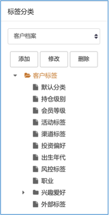
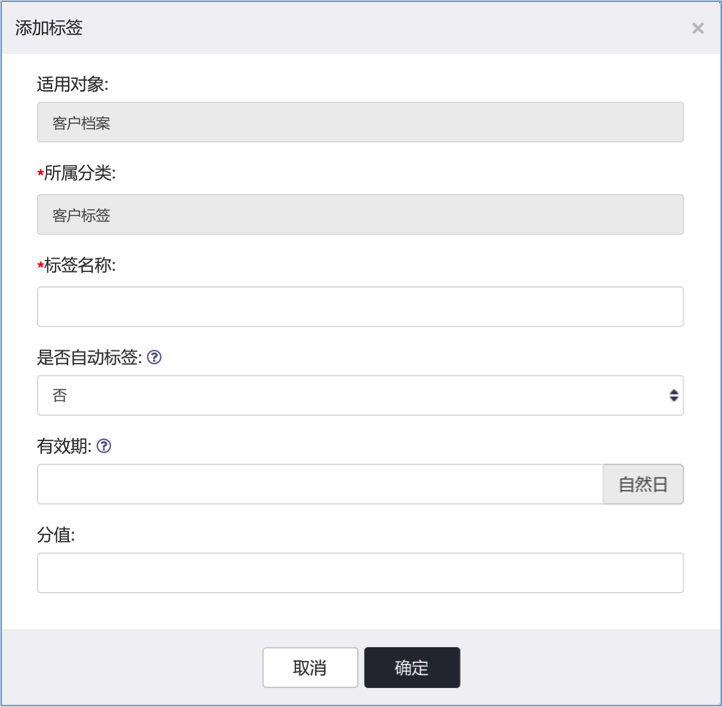
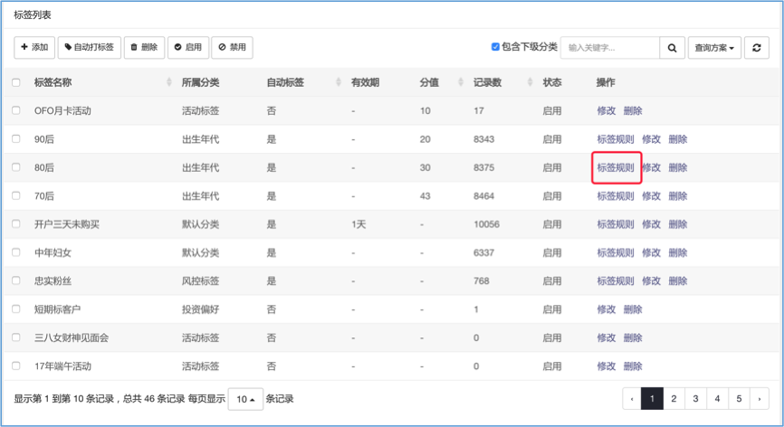
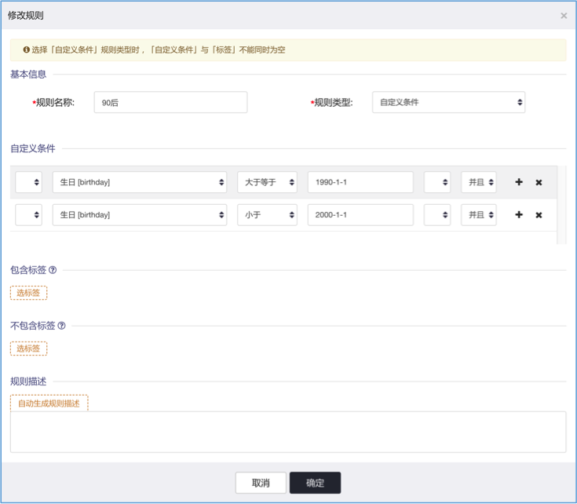
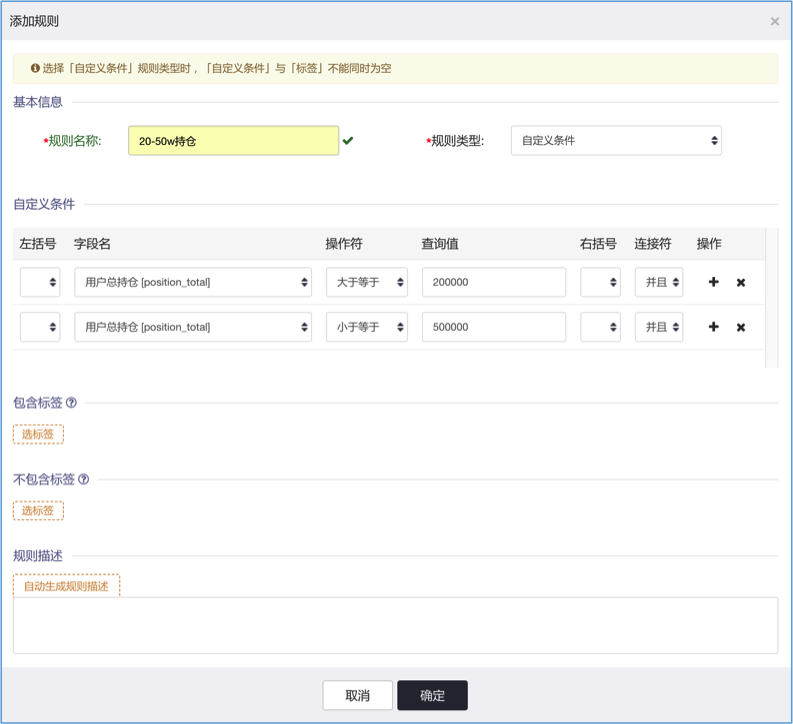
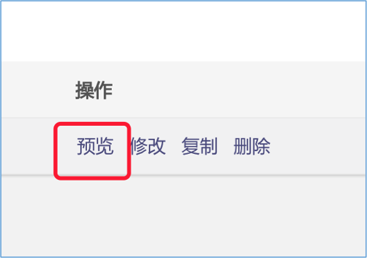
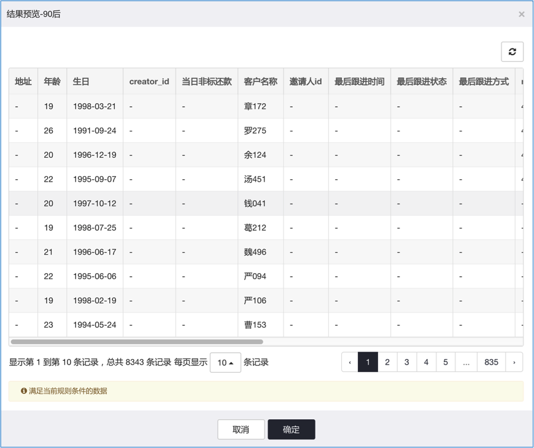
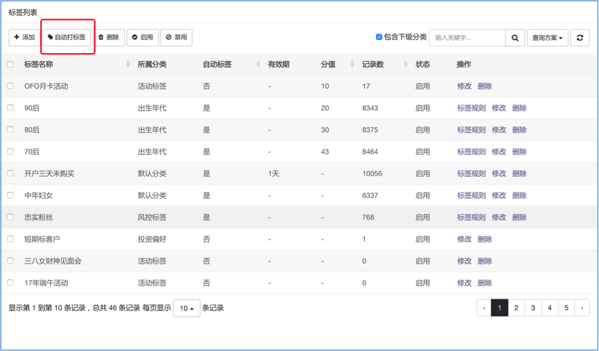

# 标签管理

系统能给任何数据对象打标签。

标签包括全局标签以及个人标签。
其中全局标签分为自动标签与手动标签：自动标签由系统根据标签规则自动给对象打上的标签；
手动标签由系统用户手动打上，全局标签所有系统用户都能看到。
个人标签为独属于某个系统用户的标签，只能由所有者管理、查看，其他用户不能查看。

点击功能菜单`标签管理`进入标签管理界面。

## 编辑标签

> 添加标签前需要建立标签分类树，如下图所示：

!> 必须有一个分类节点

> 为某个具体标签分类添加标签，如下图所示：

!> 标签`有效期`的单位为自然日，每天晚上`23:59:59`系统自动清除失效的标签。

## 配置标签规则

!> 只能为`自动标签`配置规则

标签规则通过自定义条件或者自定义SQL语句、包含标签以及不包含标签过滤数据，为满足条件者打上该标签。

> 标签规则类型

标签规则有两种类型

- 自定义条件，根据标签适用对象，以操作符（=、<、<=、>、>=）与连接符（并、或）配合使用过滤数据
- 直接编写自定义SQL语句（不推荐）

> 包含标签

只要包含所选标签之一即可。

> 不包含标签

所得数据，不能包含任一所选标签。

*例子：建立一个标签规则为20-50w持仓，图下图所示，规则类型选择「自定义条件」，添加总户总持仓 >= 20w 并且 <= 50w的条件。*

## 预览标签规则结果

在标签规则列表中，点击`预览`按钮，可以预览符合规则条件的数据，如下图所示：

## 自动打标签

系统默认每天凌晨5:30自动更新标签，清除已过有效期的标签以及重新运行标签规则自动打标签。

用户也可以手动执行自动打标签任务，入选图所示，勾选需要自执行的自动标签，然后点击`自动打标签`按钮执行自动打标签任务：

